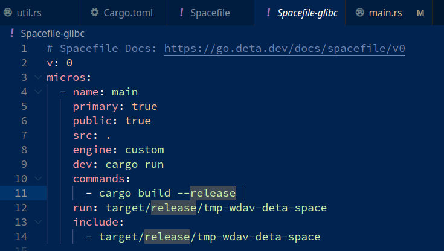
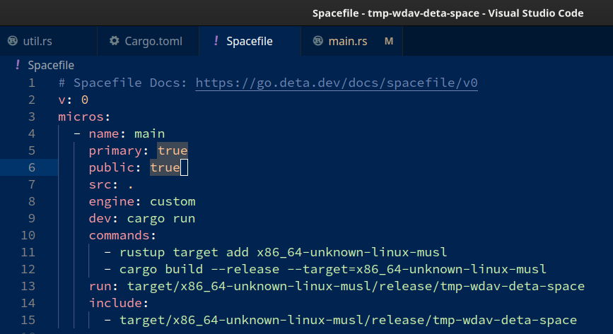
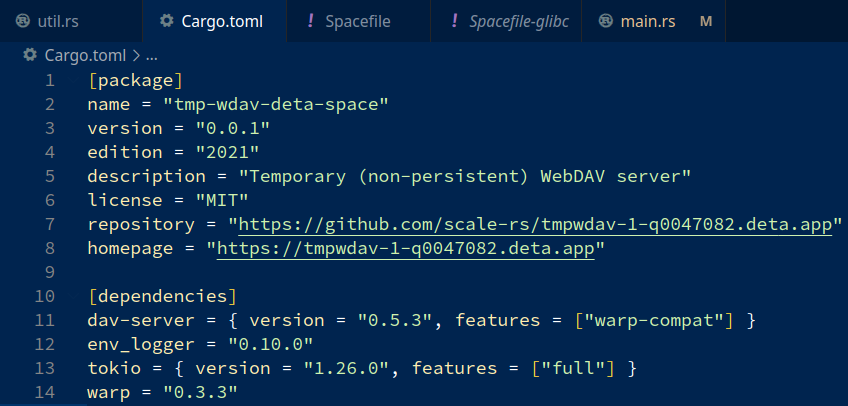
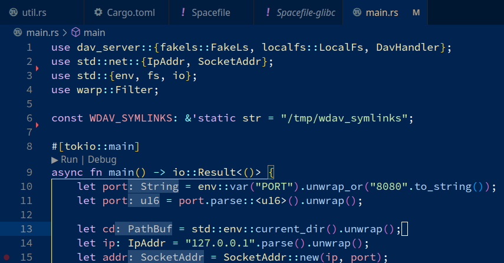
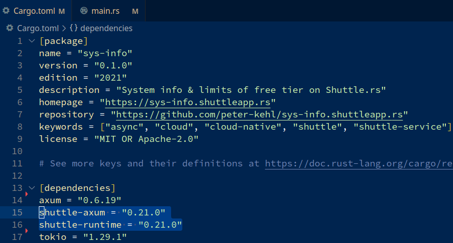
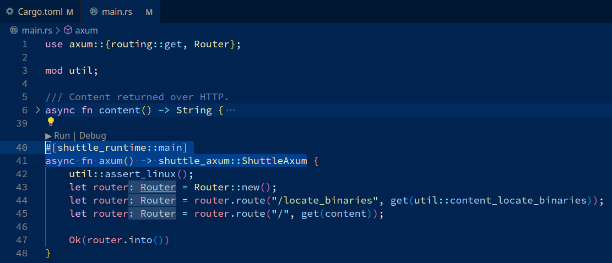
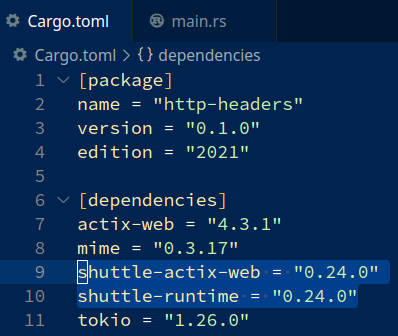
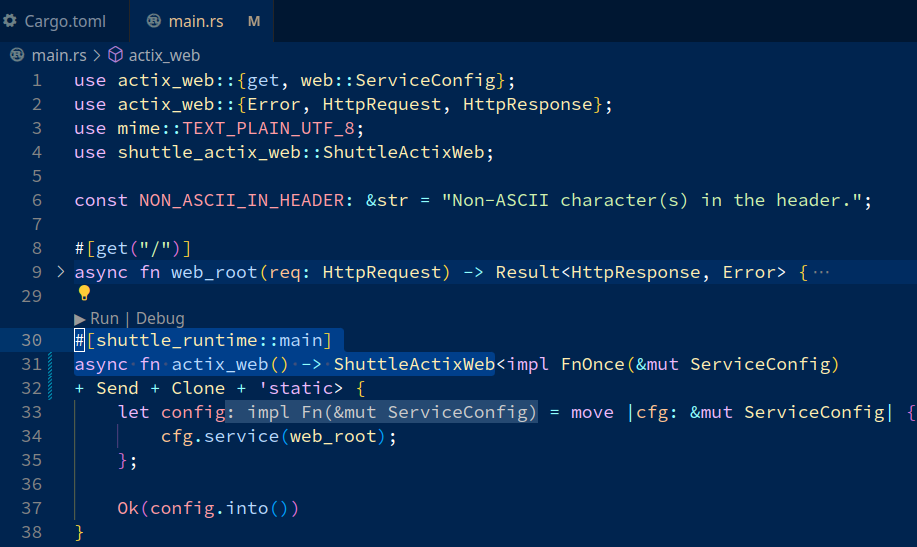

<!-- The following directions are for "Markdownlint" VS Code extension. See
  https://github.com/DavidAnson/vscode-markdownlint -->
<!-- markdownlint-disable MD013 -->
<!-- markdownlint-disable MD024 -->
<!-- markdownlint-disable MD025 -->
<!-- markdownlint-disable MD033 -->
<!-- The following comment hides this section from being shown by
     https://peter-kehl.github.io/deta.space_shuttle.rs.
-->
<!-- .slide: data-visibility="hidden" -->
# Slides & alternative navigation

If you are seeing this, consider viewing [presentation slides
(online)](https://peter-kehl.github.io/deta.space_shuttle.rs) instead. Or see
[README-NAVIGATE-SLIDES.md
(online)](https://github.com/peter-kehl/present_markdown_reveal.js/blob/main/README-NAVIGATE-SLIDES.md)
for alternatives.

---

# Rust applications on Deta.Space & Shuttle.rs

- Shuttle.rs [www.shuttle.rs](https://www.shuttle.rs/) and Deta.Space
[deta.space/docs/en](https://deta.space/docs/en) are platforms for development and deployment of
cloud applications.
- They both support [Rust](https://www.rust-lang.org/). Let's look at which one you may want.

 

## Alternative access to this content

- You can see the slides online at
[peter-kehl.github.io/deta.space_shuttle.rs](https://peter-kehl.github.io/deta.space_shuttle.rs/)
(also with a dark theme).
- If you clone them
[github.com/peter-kehl/deta.space_shuttle.rs](https://github.com/peter-kehl/deta.space_shuttle.rs)
or download them
[https://github.com/peter-kehl/deta.space_shuttle.rs/archive/refs/heads/main.zip](https://github.com/peter-kehl/deta.space_shuttle.rs/archive/refs/heads/main.zip)
and follow a few steps in its `README.md`, you can also render the slides locally and offline. Along
with a PDF.
- Of course, your comments or pull requests are welcome.

---

# Disclaimers (part 1/2)

- This is __not__ a complete introduction to either platform. Their existing documentation is
  already awesome.
- Both are agile/work in progress. Especially, functionality can be ahead of the documentation. Join
  and shape it!
- Not fully comparable. They share or differ in some features, but other features or limitations are
  unique to one or the other.
- Updated in mid August 2023.

---

# Disclaimers (part 2/2)

- Most features and limits considered here are __not__ Rust-specific. However, they affect which
  platform to choose based on/for
  - an existing application or system design, or
  - a new system design, or
  - integration with non-Rust components, or
  - portable or platform-specific API's/database/storage, or
  - sharing of applications
  - developer base & instance owner base
  - data isolation, or
  - limits/quotas and affected use cases, or
  - options for cloud providers, or private cloud, or
  - an (optional) commercial use.

---

# Overview

- Brief comparison of Deta.Space and Shuttle.rs at code level. For more details see:
  - Shuttle.rs:
    - [sys-info.shuttleapp.rs](https://sys-info.shuttleapp.rs/) & its
      [source](https://github.com/peter-kehl/sys-info.shuttleapp.rs) using Axum
    - [http-headers.shuttleapp.rs](https://http-headers.shuttleapp.rs/) and its
      [source](https://github.com/peter-kehl/http-headers.shuttleapp.rs) using Actix-web
  - Deta.Space:
    - [sysinfo-1-s4498989.deta.app](https://sysinfo-1-s4498989.deta.app/ls) & its
      [source](https://github.com/peter-kehl/sysinfo-1-s4498989.deta.app) using Axum
    - [tmpwdav-1-q0047082.deta.app](https://tmpwdav-1-q0047082.deta.app/) & its
      [source](https://github.com/scale-rs/tmpwdav-1-q0047082.deta.app) using Warp (which is based
      on Hyper)
      - I will publish my Firefox bookmarks & highlights on Rust, Shuttle.rs and Deta.Space on this
        WebDAV server soon. Check here for an update.
- Features and Quantitative differences between them.
- Let's see which platform may suit you.

 

# Spoiler Alert

- I love each. So exciting.

SpeakerNote: Welcome to a brief introduction & comparison of development & deploying Rust
applications on Shuttle.rs & Deta.Space platforms. You can also read these slides with more details,
which we skip here for brevity.

---

# Deta.Space: Spacefile with defaults (GLIBC)

---

# Deta.Space: Spacefile with MUSL target

---

# Deta.Space: Cargo.toml

---

# Deta.Space: Getting the port number

---

# Shuttle.rs: Cargo.toml for Axum

---

# Shuttle.rs: Custom crates for Axum

---

# Shuttle.rs: Cargo.toml for Actix-web

---

## Shuttle.rs: Custom crates for Actix-web

---

# Shared Features

- local development on Linux, Mac OS & Windows
- easy deployment on the respective platform's cloud, in a Docker-like Linux container
- no way to run `su`/`sudo` (or not documented), nor to customize at Docker level (for example: to
  access remote storage by mounting FUSE file systems)
- No rate-limiting logic or other IP-dependant logic can be performed by the app itself. That is
  [documented for
  Deta.Space)(https://deta.space/docs/en/build/reference/runtime#important-notes-for-micros). That's
  also [the reality for Shuttle.rs](https://http-headers.shuttleapp.rs) (even though not
  documented).
  
  Why? We can't access the client IP (unless you [use Cloudflare
  DNS](https://deta.space/docs/en/build/guides/accessing-client-ip-address), or any DNS/reverse
  proxy that injects the client IP in a custom HTTP header).
- support & community on their Discord servers

---

# Deta.Space Features (part 1/4)

- the deployed application can be private (for the developer only), or public ("published")
- Even if the application is public, the developer can deploy an unpublished (test) version of that
  public application. Such a version is visible only to her/him.
- a public (published) application can still have parts which are private
- to access a private application, or private URLs of a public application, the application owner is
   authenticated by Deta.Space. (Deta authenticates the user through AWS, but it [doesn't have
   access to her/his password](https://deta.space/privacy).)
- mesh design
  - Mesh of computes: An application can consist of up to five
    ["micros"](https://deta.space/docs/en/build/fundamentals/the-space-runtime/micros) (computes).
    Each can be developed in any of the supported languages.
  - Suitable if we want to add access control on top of/in front of an existing/3rd party codebase
    (installed as a part of your application). We can create a "proxy" that performs access control.
    It then forwards the request to the other (existing/3rd party) application instance, deployed in
    another micro. (Such a micro would not be public.) We can proxy for example with
    [warp_reverse_proxy](https://docs.rs/warp-reverse-proxy).

---

# Deta.Space Features (part 2/4)

- mesh design (continued)
  - Mesh of languages/frameworks: Each micro within the same application can use any of the
    supported languages/frameworks.
- Rust applications don't get special handling. Instead, Rust micros have the "custom" type.
- [Rust bindings for Deta API](https://github.com/jnsougata/deta-rust-sdk) are only unofficial.
- No special Rust crates/macros or code, other than getting the basic configuration. That can make
  the code a little bit more portable/flexible. But then you couldn't store data with
  Deta.Base/Deta.Store (see below).
- [not with PostgreSQL/MySQL... unless you use a pool
  manager](https://deta.space/docs/en/build/reference/runtime#important-notes-for-micros)
- no restrictions on Rust version, nor on crate versions
- Rust support is new. There are only a few examples of Rust applications so far. But they are
  growing!
- If you get `GLIBC` issues with Rust on Deta.Space deployment, use [`MUSL`
  target](https://github.com/peter-kehl/sysinfo-1-s4498989.deta.app/blob/main/Spacefile-musl)
  instead.
- [not for: background/long tasks, Discord bots,
  Websockets](https://deta.space/docs/en/build/reference/runtime#important-notes-for-micros)
  (specifically: not for Discord bots)

---

# Deta.Space Features (part 3/4)

- database & storage provided by the platform is only through their own NoSQL (Deta.Base) and their
  own storage (Deta.Store) API. If you use those, the source code is not portable. (Unless you
  create traits or wrappers. Such abstractions are a part of good design. But they add complexity
  when creating them, and even more so when maintaining.)
- data isolation: if using Deta.Base or Deta.Store, this data is separate per instance owner - even
  if you clone someone else's published Deta application
- data provisioning: automatic
- `/tmp` (and seemingly [`/dev/shm`, too](https://sysinfo-1-s4498989.deta.app/ls))
- CRON-like [scheduled
  actions](https://deta.space/docs/en/build/fundamentals/the-space-runtime/actions)
- subdomain anonymization promotes/suggests using each instance only by its owner. If the
  application is for public, the users can "fork" their own instances.

---

# Deta.Space Features (part 4/4)

- Instance owners don't need developer skills. In other words, it's easy to have your own/separate
  deployment (an isolated clone) of an application that someone else published on Deta.Space.
- App Marketplace & commercial model: App Marketplace promotes sharing free applications. Deta.Space
  is also planning an option of applications to be paid so they would generate revenue for the
  developer.

SpeakerNote: Before we compare these platforms feature by feature, let's look at features unique to
one and then the other. Hopefully then the comparison will make more sense.

---

# Shuttle.rs Features (part 1/3)

- Specializing only in Rust. In addition to hosting, storage and deployment, Shuttle integrates with
  [multiple Rust web frameworks](https://docs.shuttle.rs/examples/other). It also provides tutorials
  on how to connect the
  [middleware](https://docs.shuttle.rs/tutorials/rest-http-service-with-axum#middleware), and
  various aspects of [security](https://docs.shuttle.rs/tutorials/rest-http-service-with-axum#cors)
  and [cryptography](https://docs.shuttle.rs/tutorials/authentication#cookies-and-session-tokens).
- Suitable for background/long tasks (for example: for Discord bots). See "No cold-start and can
  even have long-running threads" in [FAQ](https://docs.shuttle.rs/support/faq) > "How does this
  differ from using serverless framework with Rust Lambda and provided runtime?" Also suitable for
  [Websockets](https://docs.shuttle.rs/tutorials/websocket-chat-app-js).
- richer storage
  - wider variety
  - both public/free standards (portable) and proprietary (not portable)
  - RDS (SQL) and handling of migrations/updates
    - Postgres (either a [shared server](https://docs.shuttle.rs/resources/shuttle-shared-db), or a
      [dedicated instance](https://docs.shuttle.rs/resources/shuttle-aws-rds))
    - MySQL (a [dedicated instance](https://docs.shuttle.rs/resources/shuttle-aws-rds))
    - MariaDB (a [dedicated instance](https://docs.shuttle.rs/resources/shuttle-aws-rds))
    - [Turso](https://docs.shuttle.rs/resources/shuttle-turso) ([distributed
      SQLite](https://turso.tech) fork, [SQLite-compatible & with 1st class Rust
      support](https://turso.tech/pricing)). This is currently NOT hosted by Shuttle.rs, but it may
      be so in the future. Either way, it has a [dedicated crate from
      Shuttle](https://docs.shuttle.rs/resources/shuttle-turso).

---

# Shuttle.rs Features (part 2/3)

- richer storage (continued)
  - noSQL: [MongoDB through a shared database](https://docs.shuttle.rs/resources/shuttle-shared-db)
  - key/value: proprietary [Shuttle Persist](https://docs.shuttle.rs/resources/shuttle-persist)
- data isolation
- A fixed Rust version (currently `1.70`). See [FAQ](https://docs.shuttle.rs/support/faq) > "Which
  version of Rust...". Similarly, [Turso is pinned to version
  `0.30.1`](https://docs.shuttle.rs/resources/shuttle-turso).

---

# Shuttle.rs Features (part 3/3)

- Longer build times: Custom crates and attribute (procedural) macros make the (initial) local build
  times much longer (than with Deta.Space). Depending on which of the supported Rust framework you
  choose, your project has initial 300-600 dependencies (in total, most of them being indirect
  dependencies). It's unclear if Shuttle.rs deployments use (or could use) incremental builds.
- [no `/tmp`](https://sys-info.shuttleapp.rs); only `/dev/shm`
- Not promoting/targeting sharing (clones) of applications. Of course, developers are free to
  publish their code (on GIT or similar) so that others could deploy it on Shuttle.rs, too.
- Instance owners need developer skills, such as running `cargo shuttle ...`. In other words, if you
  want your own/separate deployment of an application that someone else published (on GIT...), it's
  more work than on Deta.Space.
- Commercial model: For users with more than 5? applications. But, the limits are not enforced yet.
  And, if you [become a Shuttle.rs hero](https://www.shuttle.rs/shuttle-heroes), it's free for life!
- use your [own AWS account](https://www.shuttle.rs/beta)

---

# Quantitative & other differences (part 1/2)

| Property/Limit  | Shuttle.rs | Deta.Space |
| --- | --- | --- |
| application/compute size | unspecified | [250MB](https://deta.space/docs/en/build/quick-starts/custom) per each of up to 5 micros |
| execution timeout | unspecified | [20s](https://deta.space/docs/en/build/reference/runtime#technical-specifications-for-micros) |
| RAM per execution | unclear | [250MB](https://deta.space/docs/en/build/reference/runtime#technical-specifications-for-micros) |
| RAM per container | [6GB](https://docs.shuttle.rs/introduction/how-shuttle-works) (4GB during high contention: very rare, see [FAQ](https://docs.shuttle.rs/support/faq) > "What happens when I create a project?") | unclear |
| `/dev/shm` and/or `/tmp` | unspecified (64MB on `/dev/shm`, but [no `/tmp`](https://sys-info.shuttleapp.rs/)) | [512MB](https://deta.space/docs/en/build/reference/runtime#technical-specifications-for-micros) shared between [`/dev/shm` and `/tmp`](https://sysinfo-1-s4498989.deta.app/ls) |

---

# Quantitative & other differences (part 2/2)

| Property/Limit | Shuttle.rs | Deta.Space |
| --- | --- | --- |
| processes/threads | [4 threads (per project)](https://docs.shuttle.rs/introduction/how-shuttle-works) | [1024 (per micro)](https://deta.space/docs/en/build/reference/runtime#technical-specifications-for-micros) |
| HTTP payload | unspecified | [5.5MB](https://deta.space/docs/en/build/reference/runtime#technical-specifications-for-micros) |
| database and/or object storage | [10GB on free tier](https://docs.shuttle.rs/introduction/how-shuttle-works#project-limitations), but not enforced yet. (Plus, free for life if you become a hero.) | unspecified (but personal use is free for life) |
| clouds/regions | AWS [eu-west](https://github.com/shuttle-hq/shuttle-docs/issues/162) and more planned. (See [FAQ](https://docs.shuttle.rs/support/faq) > Do we plan to support multiple regions?) | [AWS](https://deta.space/privacy) and potentially planning for [GCP and other clouds](https://jobs.deta.space/?ashby_jid=739b845d-17ff-475c-b05f-649801e919ad) |

SpeakerNote:

---

# Choosing between them (part 1/6)

| Feature | Deta.Space | Shuttle.rs |
| ------- | ---------- | ---------- |
|         | no stars to `***`  | no stars to `***`  |
| `/tmp` | `***` (and `/dev/shm`, too) | `/dev/shm` only |
| max. processes/threads | 4 (per app) | 1024 (per micro) |
| max. HTTP payload | max. 5.5MB | |
| max. RAM (unclear) | 250MB | 4GB (usually 6GB) |
| option to use your own AWS account | | `***` |
| private apps (authenticated through the platform) | `***` (one user only: the app instance owner) | |

---

# Choosing between them (part 2/6)

| Feature | Deta.Space | Shuttle.rs |
| ------- | ---------- | ---------- |
| private parts of public apps (authenticated through the platform) | `***` (one user only: the app instance owner) | |
| single user (owner) authentication | `***` | (see multi user below) |
| multi user authentication | | not provided, but they have a [detailed tutorial](https://docs.shuttle.rs/tutorials/authentication) on how you can implement/integrate it |

---

# Choosing between them (part 3/6)

| Feature | Deta.Space | Shuttle.rs |
| ------- | ---------- | ---------- |
| mesh of computes | `***` (up to 5 computes per app) | (No specific support. You'd need to integrate them into one Rust application. If those parts use different web frameworks and can't be migrated into one framework, you'd need to run those respective frameworks at different ports and proxy/forward to them.) |

---

# Choosing between them (part 4/6)

| Feature | Deta.Space | Shuttle.rs |
| ------- | ---------- | ---------- |
| mesh of languages/frameworks | `***` | |
| 1st class support for/primarily for/dedicated to Rust | `*` (not yet; but Deta is considering moving the internal tooling from Golang to Rust) | `***` Rust only; custom crates and macros for config automation/integration; even the tooling is in Rust: [`cargo shuttle`](https://github.com/shuttle-hq/shuttle) |
| background/long tasks/Discord bots | (specifically: no) | `***` |
| CRON-like scheduled actions | `***` (granularity down to one minute)| |

---

# Choosing between them (part 5/6)

| Feature | Deta.Space | Shuttle.rs |
| ------- | ---------- | ---------- |
| Stability + Ergonomics: Official Rust SDK/bindings | unofficial only | `***` |
| Portability > __no__ need for special crates/macros | `***` | |
| Portability > __no__ restrictions on Rust version or channel, or crate versions | `***` | |
| Storage > PostgreSQL/MySQL/MariaDB | (no specific support; you need a connection pool) | `***` (supported & hosted) |
| Storage > SQLite/Turso | `*` officially read-only SQLite only; but Turso is likely to work | `***` Turso |

---

# Choosing between them (part 6/6)

| Feature | Deta.Space | Shuttle.rs |
| ------- | ---------- | ---------- |
| Storage > MongoDB | | `***` |
| Storage > Proprietary NoSQL | `***` | |
| Storage > Proprietary key-value | `***` | `***` |
| Free plan: Any (legal) use | `***` | `***` (with 10GB storage) |
| Commercial plan: Over the quotas | | `***` planned |
| Free model: Marketplace of (personal isolated clones of) applications | `***` | |
| Commercial model: Marketplace of paid (personal isolated clones of) applications | `***` planned | |

---

# Summary

- Choose based on your needs for storage, memory, parallelization, non-Rust/multiple Rust component
  integration, and application owner/user base models.
- Thank you to both. Loving them.
- Let's get on cloud, Rustaceans!
